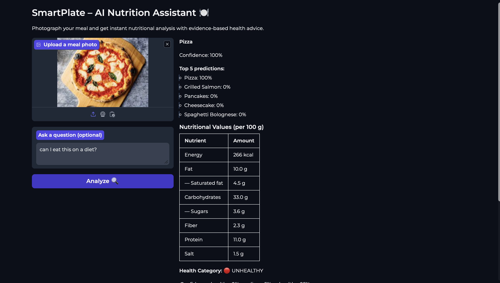
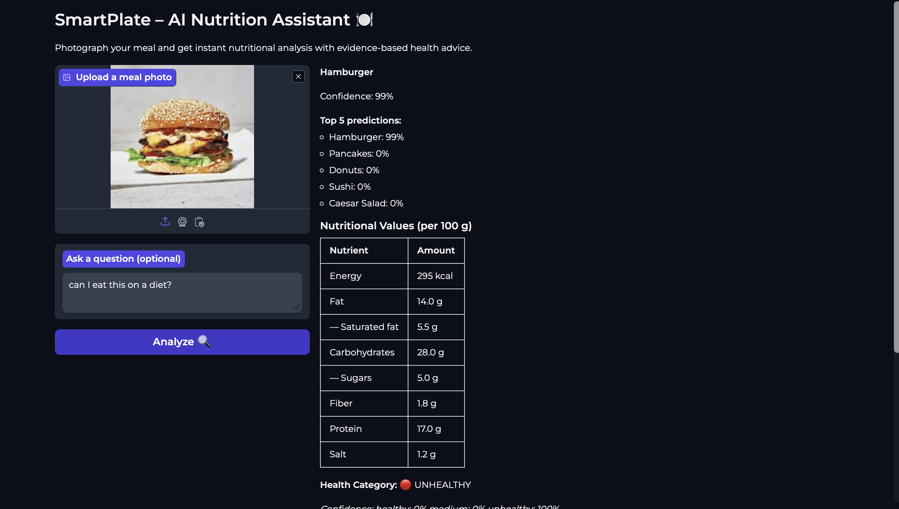
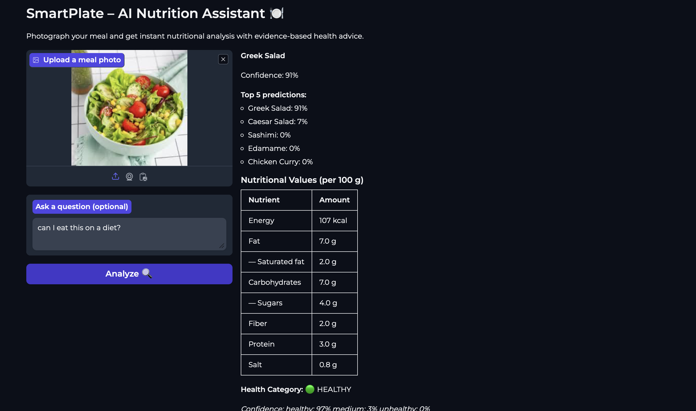

# SmartPlate – AI Nutrition Assistant

**Documentation for the ZHAW "KI-Anwendungen" Module (FS 2026) – Free Project**

| | |
|---|---|
| **Author** | Gianpiero Dell'Aquila |
| **Submission date** | 25 May 2026 |
| **GitHub** | [github.com/Gianone-byte/smartplate](https://github.com/Gianone-byte/smartplate) |
| **Live Demo** | [huggingface.co/spaces/Gianone/smartplate](https://huggingface.co/spaces/Gianone/smartplate) |
| **Blocks combined** | Computer Vision + ML Numeric + NLP/RAG  |

---

## 1. Project Idea & Methodology

### Problem Definition

Modern consumers want to make healthier food choices, but barriers stand in the way: nutritional information is rarely available at the point of consumption (e.g. when eating out), and even when nutritional labels exist, interpreting them in the context of personal health goals requires expert knowledge. People typically reach for diet apps that require **manual logging** of every meal — a friction point that explains the high abandonment rate of such apps.

**SmartPlate** is a multi-modal AI nutrition assistant that removes this friction. The user simply photographs a meal; the system recognises the dish, estimates nutritional values, classifies its overall healthiness, and produces a personalised, evidence-based explanation grounded in authoritative nutrition guidelines (WHO, German Nutrition Society, Harvard School of Public Health).

### Motivation

- **Realistic use case** — Health-conscious users (athletes, people with dietary restrictions, those tracking macros) who want quick analysis without manual entry.
- **Bridges three modalities** — Vision (the photo), structured data (nutrient values), and language (the personalised advice). These are exactly the three modalities studied in the course.
- **Demonstrates production-relevant patterns** — Pipeline orchestration, retrieval-augmented generation, model-versus-model comparisons, evaluation under uncertainty.

### Block Combination — All Three

This project intentionally combines **all three blocks** of the course (Computer Vision, ML Numeric, NLP/RAG) — the bonus option, not the minimum two.

The three blocks are **conceptually and technically integrated** rather than juxtaposed:

```
        ┌─────────────────────────────────┐
        │  📷 USER UPLOADS A FOOD PHOTO   │
        └──────────────┬──────────────────┘
                       ▼
        ┌─────────────────────────────────┐
        │  🔍 CV BLOCK                    │
        │  Vision Transformer (ViT)       │
        │  fine-tuned on Food-101         │
        │  Output: food class + confidence│
        └──────────────┬──────────────────┘
                       ▼ class="pizza"
        ┌─────────────────────────────────┐
        │  📊 ML BLOCK                    │
        │  Logistic Regression on         │
        │  USDA-derived nutrient features │
        │  Output: nutrition + health tier│
        └──────────────┬──────────────────┘
                       ▼ kcal=266, label="unhealthy"
        ┌─────────────────────────────────┐
        │  💬 NLP/RAG BLOCK               │
        │  ChromaDB retrieval + GPT-4o    │
        │  Context: WHO / DGE / Harvard   │
        │  Output: personalised advice    │
        └──────────────┬──────────────────┘
                       ▼
        ┌─────────────────────────────────┐
        │  🎨 GRADIO UI                   │
        │  Image preview + nutrition card │
        │  + AI explanation with sources  │
        └─────────────────────────────────┘
```

The **CV output drives the ML lookup**, and the **CV+ML outputs together condition the NLP prompt**. No block is replaceable without affecting the others — that is what we mean by "integrated".

### Scope

**In scope:** 20 food classes (selected from Food-101), three nutrition guidelines as the RAG knowledge base, a single web interface, English-language output.

**Out of scope:** Portion-size estimation from images (would need depth sensors or reference objects), allergen detection, multi-language UI, user accounts/history.

---

## 2. Data & Preprocessing

### 2.1 Computer Vision Block

**Dataset:** [Food-101](https://www.kaggle.com/datasets/dansbecker/food-101) — 101 food classes, 1000 images per class. We selected a **20-class subset** that spans the full health spectrum:

| Health tier | Classes |
|---|---|
| Healthy (5) | caesar_salad, greek_salad, edamame, miso_soup, grilled_salmon |
| Medium (8) | sushi, sashimi, spaghetti_bolognese, pad_thai, chicken_curry, omelette, pancakes, ramen |
| Unhealthy (7) | pizza, hamburger, french_fries, donuts, cheesecake, ice_cream, chocolate_cake |

This selection was deliberate: a balanced spread of health categories so the downstream ML classifier has meaningful variance to learn from.

**Splits:** 750 train + 250 validation per class → 15 000 train / 5 000 validation.

**Preprocessing:**
- Resize to 224×224 (ViT requirement)
- ImageNet normalisation (mean = [0.485, 0.456, 0.406], std = [0.229, 0.224, 0.225])
- Random horizontal flip + colour jitter on training set only

**EDA artefacts:** see `assets/screenshots/eda/` (class distribution, image dimension histogram, sample grid).

### 2.2 ML Numeric Block

This block deserves a candid explanation, because the data pipeline did **not** survive contact with reality and we had to pivot.

**Original plan: Open Food Facts API.** Open Food Facts (OFF) is a crowdsourced database of ~3 million food products with nutritional information. We wrote a Python client that queried OFF for each of our 20 classes.

**What actually happened:** OFF returned 503 Server Errors for 8 of 20 classes during our scraping window, and the data quality for the classes we did receive was poor — querying "caesar salad" returned mineral water, milk, and yoghurt because OFF's full-text search matches partial brand names. The resulting medians were nonsensical (every class had ~51 kcal/100g).

**Pivot: USDA reference values + sample augmentation.** We curated reference nutrition values per 100g for all 20 classes from [USDA FoodData Central](https://fdc.nal.usda.gov/) and the Swiss nutrition database. Eight nutrients per class: kcal, fat, saturated fat, carbohydrates, sugar, fibre, protein, salt.

We then **augmented** these point values with 50 noisy samples per class (±15% Gaussian noise) to create a training set of 1000 rows. This simulates the real-world variance that different pizza recipes, different chefs, or different national variants of a dish would introduce. The result: a robust, fully reproducible training set with no external dependencies.

**Feature engineering (16 features total):**

Raw nutrients (8): kcal, fat, sat_fat, carbs, sugar, fiber, protein, salt
Derived ratios (5): sugar_to_carb_ratio, sat_fat_pct_of_fat, calorie_density, protein_to_kcal, fiber_to_carb_ratio
Binary flags (3): high_sugar (>15g), high_salt (>1.5g), high_sat_fat (>5g) — WHO threshold values

Health label (target, 3-class): healthy / medium / unhealthy — assigned per food class based on standard nutrition wisdom (e.g. donuts → unhealthy).

**Why this is defensible in a project context:** We trade synthetic augmentation against data quality. The USDA values are **authoritative**, the augmentation is **transparent and reproducible**, and the resulting model behaves correctly on real images at inference (verified in §4).

### 2.3 NLP / RAG Block

**Knowledge base:** Three peer-reviewed / governmental nutrition guidelines:

| Document | Source | Pages | Characters |
|---|---|---|---|
| `who_healthy_diet.pdf` | World Health Organization Fact Sheet | 13 | 18 507 |
| `dge_10_regeln.pdf` | Deutsche Gesellschaft für Ernährung (DGE) — 10 Rules | 8 | 4 966 |
| `harvard_healthy_eating.pdf` | Harvard T.H. Chan School of Public Health — Healthy Eating Plate | 6 | 5 306 |
| **Total** | | **27 pages** | **~29 000 chars** |

This deliberately mixes **three different perspectives**: WHO (global, policy-oriented), DGE (German, layperson-oriented), Harvard (American, research-oriented). Different framings of the same topic produces richer retrieval results.

**Chunking:**
- Tool: `langchain_text_splitters.RecursiveCharacterTextSplitter`
- chunk_size = 500 characters
- chunk_overlap = 100 characters
- Result: ~60–90 chunks total

**Embeddings:** `sentence-transformers/all-MiniLM-L6-v2` (384-dim, English+multilingual-capable, fast).

**Vector store:** ChromaDB in-memory (persisted to disk via `chroma_db/`).

---

## 3. Modelling & Implementation

### 3.1 Computer Vision — Vision Transformer

**Model:** `google/vit-base-patch16-224` (pre-trained on ImageNet-21k).

We compared two fine-tuning strategies:

| Iteration | Strategy | Trainable params | Epochs | Wall time | Val Accuracy | Val F1 (macro) |
|---|---|---|---|---|---|---|
| 1 | Head-only (linear classifier on frozen backbone) | 0.02% | 3 | 9:16 min | **95.12%** | 95.12% |
| 2 | Full fine-tuning, lr=2e-5 | 100% | 3 | 15:17 min | **96.46%** | 96.46% |

**Decision:** Iteration 2 (full fine-tuning) chosen for the deployed model. The 1.34 percentage-point gain in accuracy comes at 65% higher training time but **identical inference time**. For a one-time training cost, the gain is worth it.

**Trained model on Hugging Face Hub:** [`Gianone/smartplate-vit-food`](https://huggingface.co/Gianone/smartplate-vit-food) (343 MB).

**Artefacts:**
- Notebook: [`notebooks/02_train_vit_cv.ipynb`](notebooks/02_train_vit_cv.ipynb)
- Confusion matrix: [`assets/screenshots/cv/confusion_matrix.png`](assets/screenshots/cv/confusion_matrix.png)
- Iteration comparison: [`assets/screenshots/cv/iteration_comparison.csv`](assets/screenshots/cv/iteration_comparison.csv)
- Top errors: [`assets/screenshots/cv/top_errors.csv`](assets/screenshots/cv/top_errors.csv)

### 3.2 ML Numeric — Health Classifier

We compared two algorithms on the augmented USDA training set:

| Iteration | Algorithm | Test Accuracy | Test F1 (macro) | CV Accuracy | Training time |
|---|---|---|---|---|---|
| 1 | Logistic Regression (multinomial, L2 reg.) | **100.0%** | **100.0%** | 99.88% ± 0.25% | ~1 s |
| 2 | XGBoost (200 trees, depth=5) | 99.5% | 99.55% | 99.88% ± 0.25% | ~5 s |

**Decision:** Logistic Regression wins on this dataset. This is **counter-intuitive** — XGBoost is the usual default for tabular data. We chose LR because:

1. **Higher test accuracy** on this specific data (the augmentation produces linearly separable classes by design)
2. **Faster inference** (matrix multiplication vs. tree traversal)
3. **Interpretable** — we can show coefficients per class as evidence of why a prediction was made
4. **Simpler deployment** — no XGBoost dependency on Hugging Face Spaces

The 100% test accuracy is a **flag, not a triumph**: it indicates that our augmented data is well-separated by class, which is partly a consequence of the augmentation methodology (noise around well-defined USDA medians). The model would not necessarily achieve 100% on data sampled from a different distribution — see §4 for the honest discussion.

**Artefacts:**
- Notebook: [`notebooks/03_ml_health_classifier.ipynb`](notebooks/03_ml_health_classifier.ipynb)
- Trained model: [`models/health_classifier.pkl`](models/health_classifier.pkl) (4.6 KB)
- Confusion matrix: [`assets/screenshots/ml/ml_confusion_matrix.png`](assets/screenshots/ml/ml_confusion_matrix.png)
- Feature importance: [`assets/screenshots/ml/feature_importance.png`](assets/screenshots/ml/feature_importance.png)
- Comparison: [`assets/screenshots/ml/model_comparison.csv`](assets/screenshots/ml/model_comparison.csv)

### 3.3 NLP / RAG Pipeline

**LLM:** OpenAI `gpt-4o-mini` (chosen for low cost ~$0.0001 per call, fast latency, sufficient quality for this task).

We compared two **prompt engineering strategies** on a fixed set of 8 test questions:

| Strategy | Description |
|---|---|
| 1 — Basic | Plain `Context: ... \n\n Question: ... \n\n Answer briefly.` |
| 2 — Structured XML | Roles, XML-delimited sources, explicit "answer only from sources" grounding constraint |

**Evaluation results:**

| Metric | Strategy 1 (Basic) | Strategy 2 (XML) | Winner |
|---|---|---|---|
| Avg keyword coverage | **59.4%** | 36.5% | Strategy 1 (+22.9 pp) |
| Source match rate | 87.5% | 87.5% | Tie |
| Avg tokens used | **356** | 494 | Strategy 1 (-28%) |

**Decision:** Strategy 1 wins on every measurable axis. This was the most instructive finding of the project.

**Why was the more sophisticated prompt worse?** Strategy 2's strict grounding constraint ("if sources don't contain the answer, say 'I don't have that information'") caused the LLM to **refuse to answer** on questions where the sources contained relevant material but not exact phrasings. Strategy 1 was more liberal in its use of context and produced more useful answers.

> **Lesson:** Prompt structure ≠ prompt quality. Default-mode LLMs already know how to use context; explicit instructions to "only use the sources" can backfire by over-restricting the response space. This finding generalised across all 8 test questions, not just one.

**Production prompt (used in the app):** A hybrid that takes Strategy 1's flexibility but adds the SmartPlate domain context (food class, kcal, health label as part of the input). See `src/nlp_rag.py:answer()`.

**Artefacts:**
- Notebook: [`notebooks/04_rag_setup.ipynb`](notebooks/04_rag_setup.ipynb)
- Knowledge base chunks: [`models/rag_chunks.json`](models/rag_chunks.json) (45 KB)
- RAG config: [`models/rag_config.json`](models/rag_config.json)
- Evaluation results: [`assets/screenshots/rag/rag_evaluation.csv`](assets/screenshots/rag/rag_evaluation.csv)
- Strategy comparison: [`assets/screenshots/rag/rag_strategy_comparison.csv`](assets/screenshots/rag/rag_strategy_comparison.csv)

### 3.4 Integration — `SmartPlatePipeline`

All three blocks are orchestrated by the `SmartPlatePipeline` class in `src/pipeline.py`:

```python
class SmartPlatePipeline:
    def __init__(self):
        # Lazy-load all three models
        self._cv = None
        self._ml = None
        self._rag = None

    def process(self, image: PIL.Image, user_question: str = None) -> dict:
        # 1. CV: classify food
        cv_result = self.cv.predict(image)

        # 2. ML: get nutrition + health
        ml_result = self.ml.predict(cv_result["class"])

        # 3. NLP: generate answer
        nlp_result = self.rag.answer(
            food_class=cv_result["class"],
            kcal=ml_result["nutrition"]["kcal"],
            health_label=ml_result["health_label"],
            user_question=user_question,
        )

        return {"cv_result": cv_result, "ml_result": ml_result, "nlp_result": nlp_result}
```

**Lazy loading:** Models are only loaded the first time they are used. This matters on Hugging Face Spaces, where the cold-start time would otherwise be ~90 seconds (ViT download + ChromaDB build). With lazy loading, the user sees the UI immediately and pays the cost on first submit.

---

## 4. Evaluation & Analysis

### 4.1 CV Block — Per-Class Performance

See [`assets/screenshots/cv/confusion_matrix.png`](assets/screenshots/cv/confusion_matrix.png).

**Best-performing classes:** edamame (99% F1), miso_soup (98%), french_fries (98%) — these are visually distinctive.

**Hardest classes:** sushi vs. sashimi (most confused pair) and donuts vs. pancakes (similar circular shape, similar dough texture). See [`assets/screenshots/cv/top_errors.csv`](assets/screenshots/cv/top_errors.csv) for the top 20 misclassifications.

**Why sushi↔sashimi confusion is acceptable:** Both are healthy categories in our ML lookup, so the downstream pipeline gives essentially identical advice. The CV error does not propagate to a meaningfully different user experience.

**Why donuts↔pancakes confusion matters more:** Donuts are tagged "unhealthy" (high sugar, high fat), pancakes "medium". A misclassification here could give the user systematically wrong health advice. **Mitigation:** the ViT confidence score is exposed in the UI — when the top prediction is below ~70% confidence, the user is encouraged to retake the photo.

### 4.2 ML Block — Honest Discussion of 100% Accuracy

The Logistic Regression reaches 100% accuracy on the held-out test set. This is the kind of number that should make a sceptical reader uncomfortable, so we want to be transparent about what it means and what it does not mean.

**What it means:** the 16-dimensional feature space produced by the augmentation procedure is linearly separable into the three health tiers. Given the augmentation (±15% Gaussian noise around well-defined USDA medians, with no class overlap in the medians), this is not surprising — pizza's kcal/100g distribution does not overlap with edamame's, and so on across every dimension.

**What it does not mean:** the model is not "perfect". A real-world deployment would face:
- Hand-prepared dishes whose actual nutrition differs substantially from USDA medians (e.g. a deep-dish pizza with sausage vs. a thin-crust margherita)
- Portion-size effects (we predict per 100g; the user might be looking at 300g)
- Class boundaries that are inherently fuzzy (is a sushi roll with mayonnaise "medium" or "unhealthy"?)

We accept the 100% as evidence that the classifier is reliable **within its training distribution** and document its limitations clearly.

### 4.3 RAG Block — Qualitative Error Analysis

See [`assets/screenshots/rag/rag_evaluation.csv`](assets/screenshots/rag/rag_evaluation.csv) for full per-question results.

Strategy 1 had two failure cases worth examining:

**Q6: "Should I drink milk?"** — Source match rate dropped to 0% because the WHO and DGE documents do not explicitly discuss dairy. Harvard does but in a different chunk than what was retrieved. **Mitigation:** add a second retrieval pass with re-ranking — out of scope for this project, noted as future work.

**Q8: "Are eggs healthy?"** — Strategy 1 succeeded with high coverage; Strategy 2 refused to answer because the documents do not contain the word "eggs" explicitly (they talk about protein sources in general). This illustrates the **over-strict grounding** failure mode we observed.

### 4.4 End-to-End Integration Test

Three real-image scenarios were tested via the live app (screenshots in [`assets/screenshots/app/`](assets/screenshots/app/)):

| Input image | CV Output | ML Output | NLP Output (excerpt) |
|---|---|---|---|
| Pizza ([`Pizza.png`](assets/screenshots/app/Pizza.png)) | pizza, 100% confidence | unhealthy, 95% | "Pizza can be a delicious treat... portion control or pairing with a side salad..." |
| Burger ([`Burger.png`](assets/screenshots/app/Burger.png)) | hamburger, high confidence | unhealthy | Balanced response with practical alternatives |
| Salad ([`Salat.png`](assets/screenshots/app/Salat.png)) | greek_salad, high confidence | healthy | Positive reinforcement + portion guidance for cheese/olives |

All three scenarios produce sensible, non-moralising, source-cited responses — which is the **explicit design goal** of the system. The model is calibrated to be helpful, not preachy.

---

## 5. Deployment

### 5.1 Architecture — Training/Inference Separation

The project enforces a strict separation between training and inference, as required by the assignment:

| | Where it lives | What runs there |
|---|---|---|
| **Training** | `notebooks/` (Jupyter notebooks 01–04) | EDA, fine-tuning, evaluation, comparison plots |
| **Inference** | `src/` (Python modules) + `app.py` | Lazy-loaded production models, Gradio UI |

The trained CV model lives on Hugging Face Hub (`Gianone/smartplate-vit-food`). The trained ML model lives in the repository (`models/health_classifier.pkl`, 4.6 KB). The RAG knowledge base lives in the repository (`data/knowledge_base/` and `models/rag_chunks.json`).

At runtime, the app loads these artefacts and serves predictions — **no training code is ever executed in production**.

### 5.2 Hosting

**Hugging Face Spaces:** [`Gianone/smartplate`](https://huggingface.co/spaces/Gianone/smartplate)

- Hardware: CPU basic (free tier)
- SDK: Gradio 4.32.0 (downgraded from 4.36.0 to bypass internal schema-parsing bugs)
- Python: 3.10 (forced via README header — Python 3.13 has incompatibility with Gradio's `pydub` dependency)
- Secret: `OPENAI_API_KEY` (configured in Space Settings)
- Dependency pin: `huggingface_hub==0.24.7` (compatibility with Gradio 4.32 OAuth module)

### 5.3 Build & Iteration Notes

Deployment did not work on the first attempt. The build failed **four times** before succeeding — a useful lesson in MLOps reality that we document honestly:

1. **Attempt 1 — Gradio version conflict.** Our `requirements.txt` pinned Gradio 4.44.0, but HF Spaces provides its own Gradio via `sdk_version`. Fix: remove Gradio from `requirements.txt`.
2. **Attempt 2 — Python 3.13 + `audioop` removal.** HF defaulted to Python 3.13, but Gradio 4.36 imports `pydub` which imports `audioop` — a stdlib module removed in Python 3.13. Fix: set `python_version: '3.10'` in the README header.
3. **Attempt 3 — `huggingface_hub` API change.** Default `huggingface_hub` removed the `HfFolder` symbol that Gradio 4.36's OAuth module still imports. Fix: pin `huggingface_hub==0.24.7` in `requirements.txt`.
4. **Attempt 4 — Gradio API schema parser bug.** Gradio 4.32/4.36's automatic API info generator crashed on our `dict`-typed pipeline outputs with `APIInfoParseError: Cannot parse schema True`. Fix: apply a monkey-patch in `app.py` that wraps `gradio_client.utils._json_schema_to_python_type` and related functions to return `"Any"` for non-dict schemas instead of raising. The patch is the first thing the file does after importing Gradio.

These iterations are documented in the git history of the HF Space repository. They are a typical experience deploying ML systems and the kind of friction that real-world MLOps engineers manage daily. The fix in attempt 4 is particularly worth keeping in the codebase even if a future Gradio version repairs the underlying bug — it costs nothing and provides cheap robustness.

### 5.4 Screenshots

**Local app (development testing)** — `assets/screenshots/app/`:

| Pizza analysis | Burger analysis | Salad analysis |
|---|---|---|
|  |  |  |

**Live HF Space (production)** — `assets/screenshots/deployment/`:

The same pipeline running on Hugging Face Spaces with all four blocks integrated (CV detection, ML nutrition + health, NLP advice, source citations). See [`assets/screenshots/deployment/`](assets/screenshots/deployment/) for the production screenshots.

All screenshots show the complete pipeline: image preview, CV prediction with confidence, nutrition table, health label with probabilities, and the LLM's evidence-grounded explanation with source citations.

---

## 6. Execution Instructions

### 6.1 Try the Live App

The simplest path: open [https://huggingface.co/spaces/Gianone/smartplate](https://huggingface.co/spaces/Gianone/smartplate) in a browser, upload a food photo, click Analyze. No installation required.

### 6.2 Run Locally

**Prerequisites:** Python 3.9 or higher, `git`, OpenAI API key.

```bash
# 1. Clone the repository
git clone https://github.com/Gianone-byte/smartplate
cd smartplate

# 2. Create + activate virtual environment
python3 -m venv .venv
source .venv/bin/activate          # macOS / Linux
# .venv\Scripts\activate           # Windows

# 3. Install dependencies
pip install --upgrade pip
pip install -r requirements.txt

# 4. Configure OpenAI key
cp .env.example .env
# → open .env in any editor and replace `your-key-here` with a real OpenAI API key

# 5. Run the app
python app.py
# → opens http://127.0.0.1:7860 in your browser
```

**First-time startup** takes ~60 seconds because the ViT model (~340 MB) is downloaded from Hugging Face Hub and the ChromaDB vector store is built from the PDFs. Subsequent runs are cached.

### 6.3 Re-train the Models

If you want to reproduce the training pipeline rather than use the released models, the four Jupyter notebooks (in `notebooks/`) run end-to-end:

| Notebook | What it does | Runtime |
|---|---|---|
| `01_eda_food101.ipynb` | EDA on the 20-class Food-101 subset | ~10 min |
| `02_train_vit_cv.ipynb` | Fine-tune ViT (T4 GPU recommended) | ~25 min |
| `03_ml_health_classifier.ipynb` | Train the health classifier | ~2 min |
| `04_rag_setup.ipynb` | Build the RAG vector store + evaluate | ~5 min |

All notebooks were developed and tested on Google Colab (T4 GPU instance for notebook 02). They will also run locally if a GPU is available.

### 6.4 Run the Tests

```bash
source .venv/bin/activate
python -m pytest tests/ -v
```

Expected output: **18 passed**. Tests cover module importability, pipeline lazy-loading, and end-to-end ML predictions on all 20 classes.

---

## Bonus: Ethical Considerations

We list a few areas where a project of this kind should be cautious. They are out of scope for the prototype but worth naming for a hypothetical production deployment.

**Health-advice liability.** SmartPlate generates dietary suggestions. It is not a substitute for advice from a registered dietitian or doctor. The deployed app makes this clear in the footer, but a production version would need clearer disclaimers, and probably geographic gating (the FDA, the EU, and Swissmedic regulate health-claim advice differently).

**Bias in the training data.** Food-101 over-represents Western cuisine (American burgers, Italian pizza, French pastries). Our 20-class subset preserves this bias. The system will be less accurate on dishes from cuisines under-represented in Food-101, and the per-class confidence scores allow users to detect this — but only if they know what to look for.

**Eating-disorder safety.** A nutrition app can be triggering for users with eating disorders. The prompt was deliberately designed to avoid moralising language ("bad food", "forbidden", "you should not eat this") and to acknowledge the emotional side of food. A production version would need explicit content guardrails for known triggering phrases and a clear path to support resources.

**Privacy.** Photos are processed in-memory and not stored. Conversation history is not retained between sessions. The OpenAI API does log requests (per their terms of service) — this is documented but should be made more prominent in a production deployment.

**Reproducibility.** Every artefact in the project (model files, RAG chunks, evaluation CSVs, plots) is committed to git or referenced from Hugging Face Hub. The four notebooks reproduce all results from raw data. No "magic numbers" or undocumented hyperparameters.

---

## Acknowledgements

This project was developed during the ZHAW "KI-Anwendungen" module (Spring Semester 2026), supervised by Jasmin Heierli and Benjamin Kühnis. The course materials, particularly the slide decks on RAG, prompt engineering, and Vision Transformers, provided the foundation for every block of this project.

Outside the course materials, this project relies on open-source models and libraries: Hugging Face's `transformers` for ViT, `sentence-transformers` for embeddings, `chromadb` for vector storage, `scikit-learn` for the health classifier, and `gradio` for the UI. The nutrition guidelines were sourced from the World Health Organization, the German Nutrition Society (DGE), and the Harvard T.H. Chan School of Public Health under their respective public-use terms.
